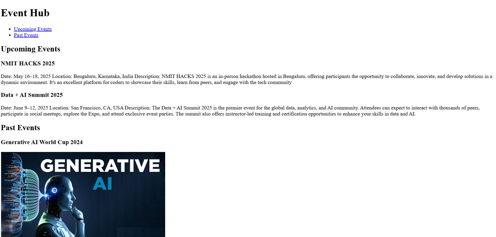

# Event Hub Page

## 📌 What This Project Covers
This project is a simple HTML page that represents an Event Hub. It lists and highlights upcoming tech events related to coding and AI, using clean structure and semantic HTML elements like `<main>`, `<nav>`, `<section>`, and `<footer>`.

## 🎯 Purpose
The purpose of this project is to practice using semantic HTML tags while simulating a real-world layout for an event portal. It strengthens your understanding of proper page structure, accessibility, and readability.

## 🛠️ Tools Used
- HTML5
- Semantic Tags (`<main>`, `<nav>`, `<section>`, `<footer>`)
- Basic Styling (if added manually)

## 📸 Screenshot

## 🌐 Live Demo
[Click here to view it live](https://codewithsam025.github.io/event-hub-page/)
